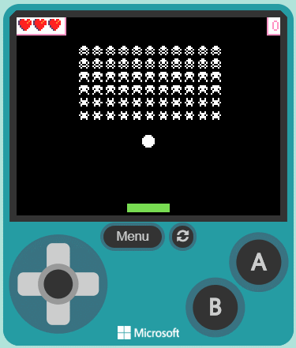
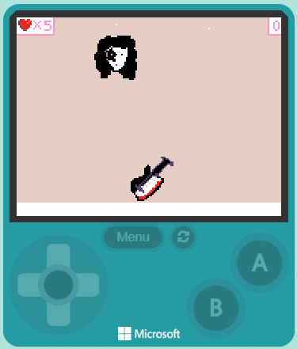
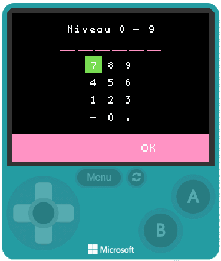
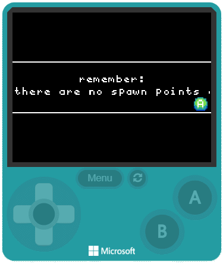
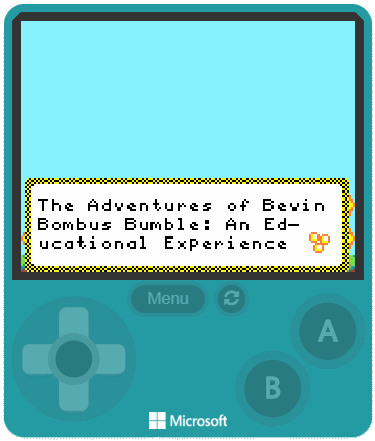

# MakeCode Arcade Games
## Album 1

---------

**square wars**  
[online](https://arcade.makecode.com/01641-86661-96897-78714)

---------

**ez maze**  
[online](https://arcade.makecode.com/68337-74786-16356-85674)

---------

**meteor travel**  
[online](https://arcade.makecode.com/07488-08884-89402-35961)

---------

**galaxy invadersl**  
[online](https://arcade.makecode.com/44999-41585-49075-61041)

---------

**space in breakout**  
[online](https://arcade.makecode.com/68957-11475-53096-25017)

---------

**I made a kiss game**  
[online](https://arcade.makecode.com/11796-13817-57105-17812)

---------

**MyTetrisClone**  
[online](https://arcade.makecode.com/49109-25743-34568-79675)

---------

**Brain cell damage**  
[online](https://arcade.makecode.com/30897-28405-49882-79418)

---------

**PacMan v2.0c**  
[online](https://arcade.makecode.com/58067-64299-04129-92042)

---------

**Adventures of Bevin**  
[online](https://arcade.makecode.com/49976-09044-76300-26941)

[From microbit/micropython Chinese community](http://www.micropython.org.cn)
